# Research on the best Database to use for Fleet Map
## What is AIS

Automatic Identification System (AIS) data - is spatio-temporal* data about positions and statuses of vessels. Each day around 38.4GB of compressed data is expected to come from AIS HUB ( for example, spire marines get 35 GB of compressed data every day from different sources https://documentation.spire.com/data-extracts/expected-ais-data-volumes/ ). AIS messages come in ~27 types (static, dynamic, voyage, safety, etc.) and carry latitude, longitude and timestamps. 

Spatio-temporal* - belonging to both space and time or to space–time.
## Database requirements
For our use case, the database option must support both real-time ingesting of large amount of data and retrieving big amounts of data for historical analytics. One of the most importants things to consider is that we deal with spatio-temporal data. So, the desired database should have an easy way of dealing with both time-range queries and spatial queries support at the same time. Thus, the requirements for the database should be:
1) Efficient injection of large sets of data
2) Efficient retrieving of large sets of data ( including filtering based off timestamps and lattidus to easily access spatio-temporal data )
3) Low-cost of storing and maintaining large sets of data
4) Easy to scale
5) Deals well with both time-range and spatial quering

### Data ingestion - temporal dataset
https://www.csitcp.org/paper/12/1214csit06.pdf#:~:text=Based%20on%20the%20experiment%20results%2C,Cassandra%20beats

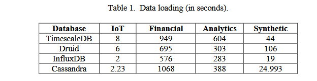

InfluxDB is the next option after Druid. InfluxDB uses many compression techniques for various
data types. It also takes up less space than the original file, but it is more than Druid. Cassandra
also takes less space than the original in all the datasets. However, Cassandra takes up more
space in the financial dataset than the original. So, as data size grows, Cassandra's performance
decreases. In terms of space utilization, TimescaleDB is the worst performer. Because
TimescaleDB is built on Postgres, storing data in tabular format takes much space. If we compare
the best and the worst performer, Druid outperforms TimescaleDB in the IoT dataset by 1.5
times, the financial dataset by 5 times, the analysis dataset by nearly 3 times, and the synthetic
dataset by almost 5 times.
### Data storage - temporal dataset
https://www.csitcp.org/paper/12/1214csit06.pdf#:~:text=Based%20on%20the%20experiment%20results%2C,Cassandra%20beats

InfluxDB uses many compression techniques for various
data types. It also takes up less space than the original file, but it is more than Druid. Cassandra
also takes less space than the original in all the datasets. However, Cassandra takes up more
space in the financial dataset than the original. So, as data size grows, Cassandra's performance
decreases. In terms of space utilization, TimescaleDB is the worst performer. Because
TimescaleDB is built on Postgres, storing data in tabular format takes much space. If we compare
the best and the worst performer, Druid outperforms TimescaleDB in the IoT dataset by 1.5
times, the financial dataset by 5 times, the analysis dataset by nearly 3 times, and the synthetic
dataset by almost 5 times.

## Perfomance - temporal dataset
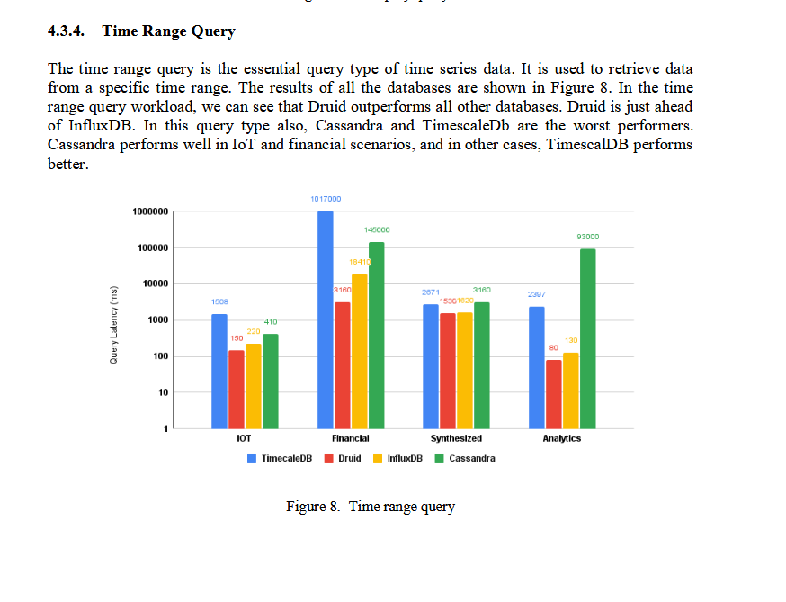
## Perfomance - spatial dataset
https://www.cs.unb.ca/~sray/papers/jackpine.pdf?utm_source=chatgpt.com

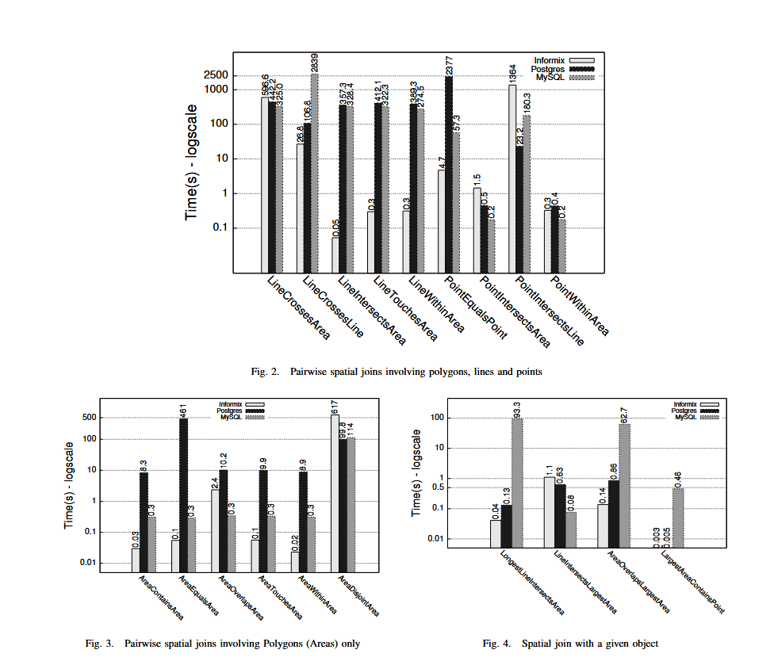
Independant research showcasing good benchmarks for spatial data queries from PostgreSQL. TimescaleDB utilizes PostgreSQL/PostGIS, so it would have the same great results. It does not compare it to NoSQL dbs, but confirms official Timescale.com research.

## Perfomance - temporal-spatio
No official academic comparison researches.
TimescaleDB - you can use hybrid queries like SELECT … WHERE time BETWEEN … AND ST_DWithin(geom, …). - timescale.com
InfluxDB - you can use EXPERIMENTAL Geo package for making spatio-temporal data queries - https://www.influxdata.com/blog/tldr-geotemporal-data-influxdb/
Druid - no information about spatio-temporal queries. But has a support for GIS data. https://blog.hellmar-becker.de/2021/09/05/geospatial-data-in-apache-druid-ingestion/

## Research conclusion - temporal dataset
The recommendations are
based on the performance comparison: I) If the focus lies on load performance, InfluxDB is the
best choice, followed by Druid, Cassandra, and TimescaleDB. II) Druid is far better than others if
the focus lies on the lowest space consumption. InfluxDB is the second-best choice. III) If there
are more aggregate queries, one can use InfluxDB. It performs very well, followed by Druid and
Cassandra. If there are queries containing data filters like time range, Druid is the best choice.

## MongoDB as an option
### Mongodb is the best option - acording to some researches. But is it so?
https://gdmc.nl/publications/2016/Managing_Historic_AIS_data.pdf#:~:text=AIS%20data%2C%20vessel%20movement%20data%2C,a%20suitable%20database%20to%20manage - delft research on AIS and where to store the data
https://al-kindipublishers.org/index.php/jcsts/article/view/8931/7607 - research on mongodb and how it handles big data
https://www.jstage.jst.go.jp/article/jinnavi/207/0/207_36/_article - japanese research which db to use for AIS suggesting mongodb as the best option

Coclusion: MongoDB can be used for large datasets

### Performance Evaluation of MongoDB and PostgreSQL for spatio-temporal data
https://zenodo.org/records/2649876#:~:text=as%20well%20as%20their%20underlying,is%20significantly%20lower%20in%20PostgreSQL

Conslusion: Postgres is faster than mongoDB and stores data more efficiently in terms if spatio-temporal data. It only means that MongoDB is out of the question as it really requires a lot of effort to make it good for the purpose we need.

## Popularity 
https://red9.com/database-popularity-ranking/

Druid - not in the top 50

TimescaleDB - not in the top 50

https://pmc.ncbi.nlm.nih.gov/articles/PMC7302557/

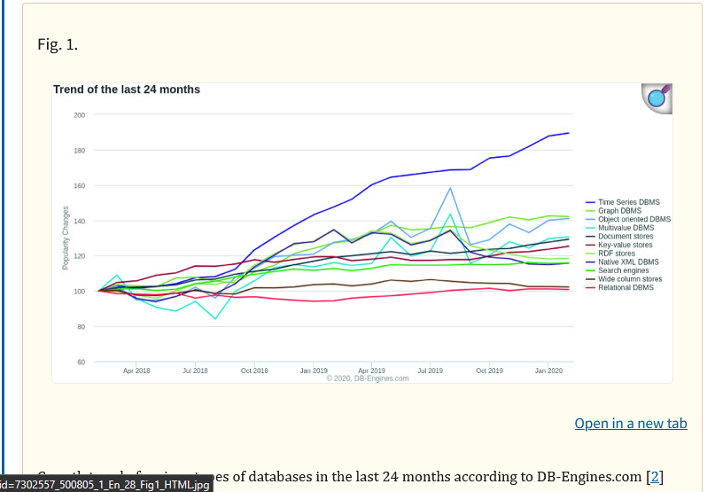
## TimescaleDB vs PostgreSQL
https://www.influxdata.com/comparison/postgres-vs-timescaledb/

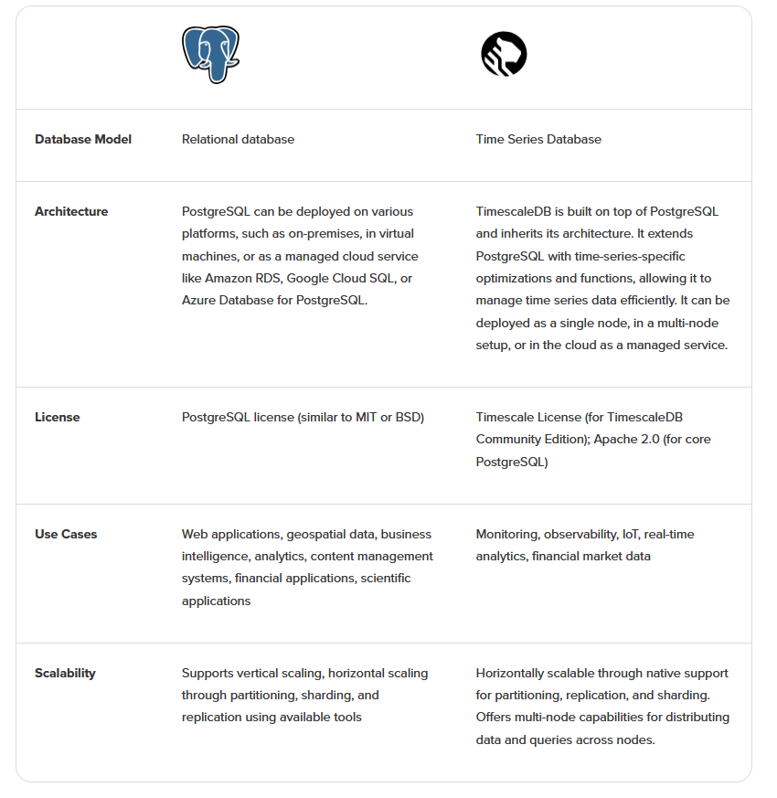

https://pmc.ncbi.nlm.nih.gov/articles/PMC7302557/

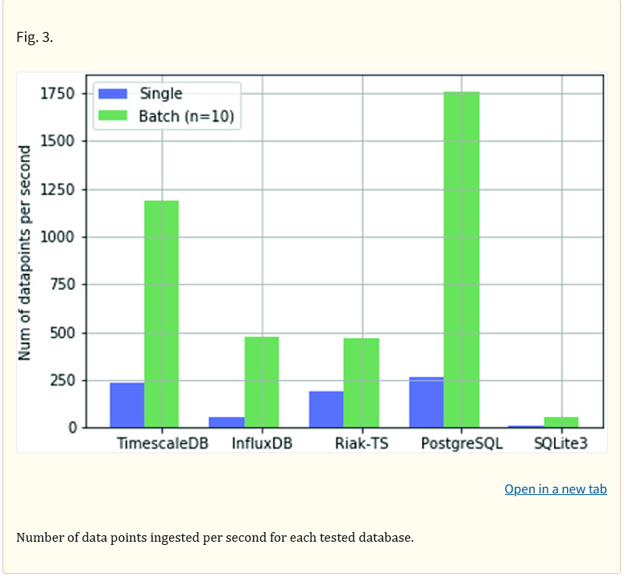
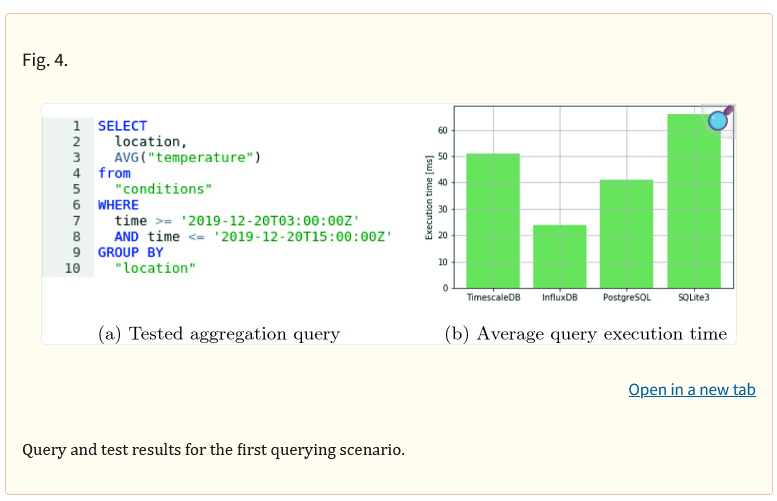
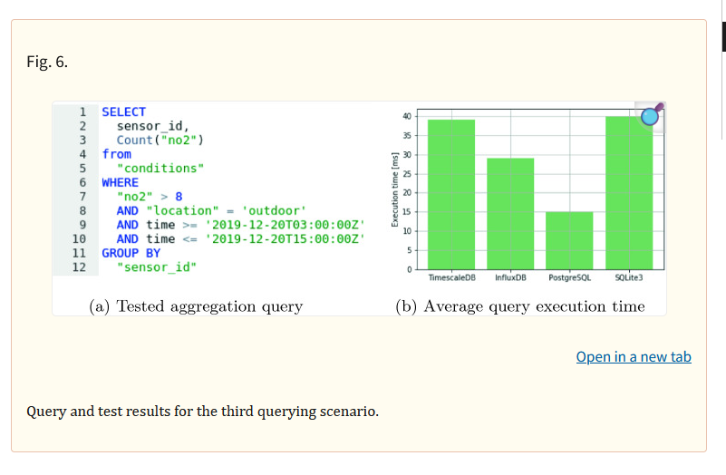
https://medium.com/timescale/timescaledb-vs-6a696248104e

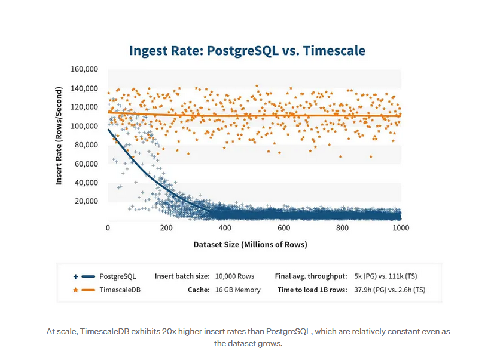
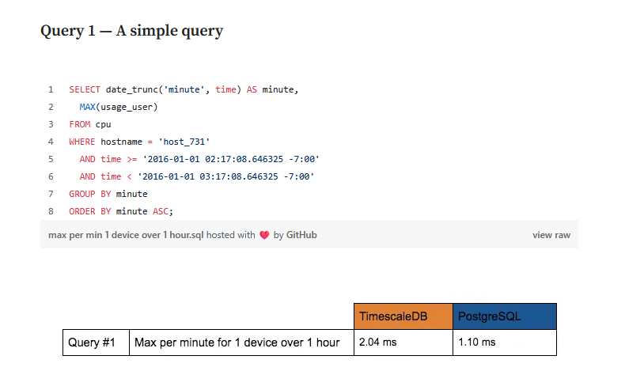
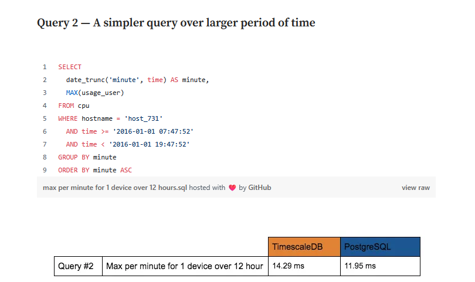
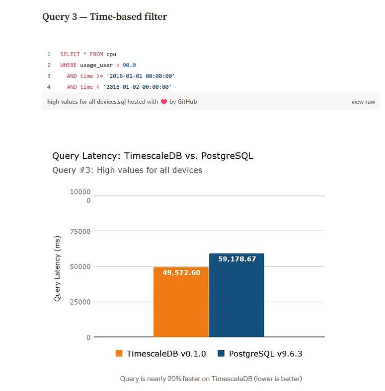
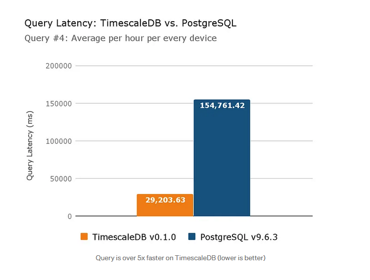
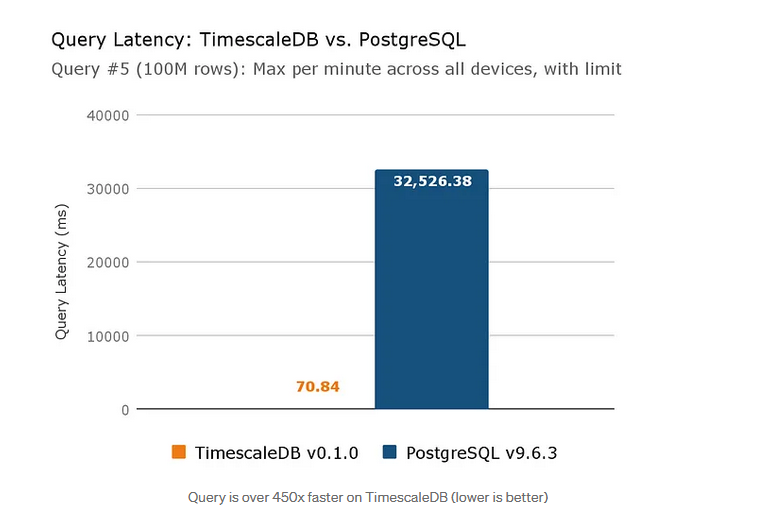
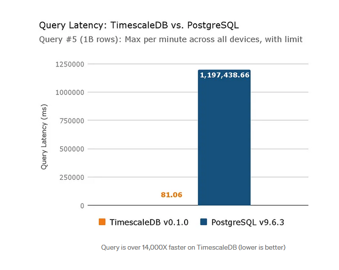
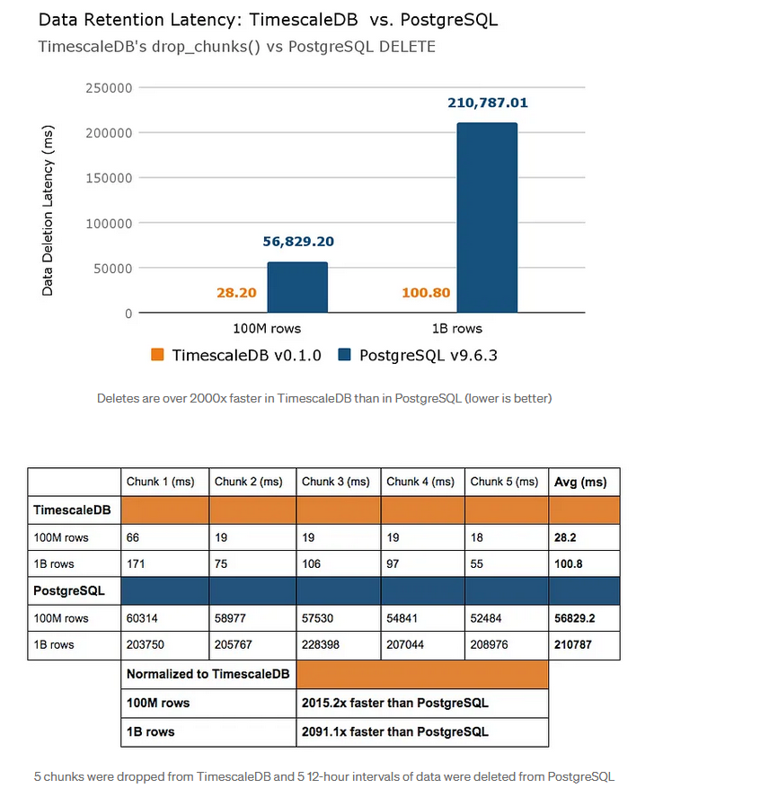
### When is TimescaleDB faster then PostgreSQL? When to use which?
https://www.timescale.com/forum/t/benchmark-shows-that-plain-postgres-is-significantly-faster/819/6

Single insert is slower for TimescaleDB then for the PostgreSQL, but TimescaleDB shines for contention, when series of data are inserted one after another. Then, yes, we would see the same graphs as TimescaleDB shows on their official website as 60x faster db then postgres and thus why Chatgpt suggests timescale as the best option, while in reality it is not always the case. For GIS data, and for out case scenario, default Postgres + PostGIS is the best option. But for retriving time-series chunks of data TimescaleDB is 1.2x-14000x faster compared to Postgres making TimescaleDB an obvious choice for retriving time-range historical data.

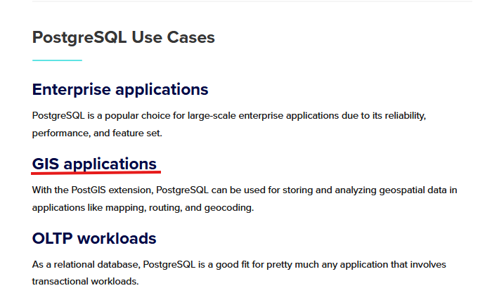
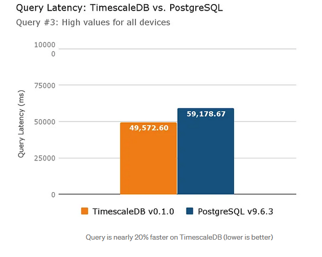
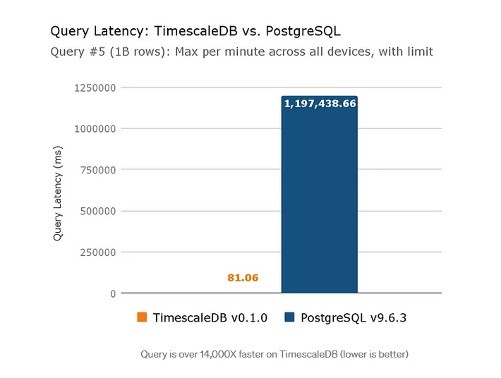
## Final conclusion

There is no one best option, as large historical database sets can be managed with either SQL or NoSQL databases, and each has its' own tradeoffs. Everything depends on specific requirements.

According to research on csitcp, noSQL db such as Cassandra is ill-suited due to to perfomance and data storage inefficency for temporal data and should not be the first choice to make, but still can be used.

According to research on zenodo, NoSQL db such as MongoDB is ill-suited due to perfomance and data storage inefficency for spatio-temporal data, and should not be an option.

According to research on csitcp, time-series databases are well-suited for storing data with timestamps. Druid is far better than others if the focus lies on the lowest space consumption. InfluxDB is the second-best choice. If the focus lies on load performance, InfluxDB is the best choice, followed by Druid, Cassandra, and TimescaleDB. So, if only temporal dimension was important to us, Druid or InfluxDB would be the best option.

According to my personal research, InfluxDB has EXPERIMENTAL support for GIS queries, which could lead to potential issues, so it is less recommended to use. Druid is great both for storing and quering spatio-temporal data, but lack learning recources and has more complexity which could lead to disability to make the right programatic choices - especially for students.

According to red9 database-popularity-ranking, Druid is not popular at all. PostreSQL and InfluxDB are the most viable choices based off popularity. 

According to InfluxDB team research, Medium article research, and TimescaleDB forum ( non advertisery ), it is clear that for our case scenario Postgres would perform much better than TimescaleDB due to no contention, but TimescaleDB would optimize queries and storage space for time-series data, saying that it could lead up to 95% of savings in storage in some scenarios. As well, data ingestion is much more cost-effective and faster in comparison.

Final suggestion: #1 TimescaleDB/PostGIS or #2 PostgreSQL/PostGIS or #3 InfluxDB
